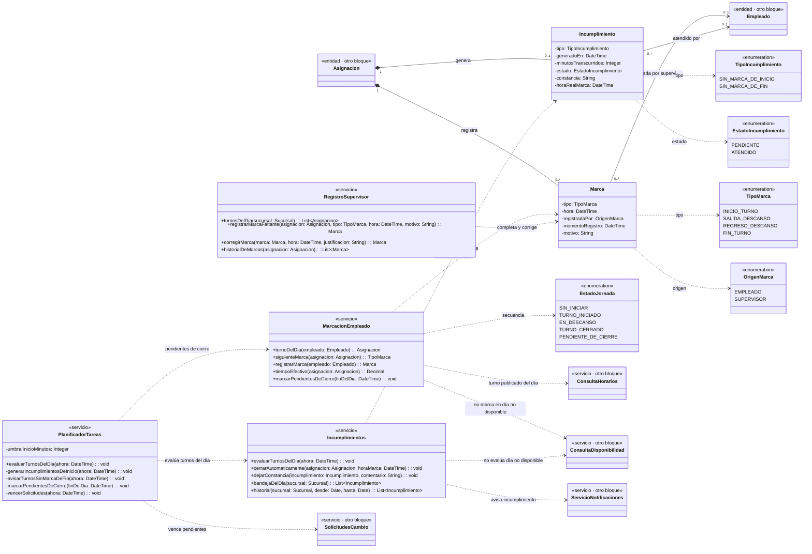

```mermaid
classDiagram
    direction LR

    class MarcacionEmpleado {
        <<servicio>>
        +turnoDelDia(empleado: Empleado): Asignacion
        +siguienteMarca(asignacion: Asignacion): TipoMarca
        +registrarMarca(empleado: Empleado): Marca
        +tiempoEfectivo(asignacion: Asignacion): Decimal
        +marcarPendientesDeCierre(finDelDia: DateTime): void
    }
    class RegistroSupervisor {
        <<servicio>>
        +turnosDelDia(sucursal: Sucursal): List~Asignacion~
        +registrarMarcaFaltante(asignacion: Asignacion, tipo: TipoMarca, hora: DateTime, motivo: String): Marca
        +corregirMarca(marca: Marca, hora: DateTime, justificacion: String): Marca
        +historialDeMarcas(asignacion: Asignacion): List~Marca~
    }
    class Incumplimientos {
        <<servicio>>
        +evaluarTurnosDelDia(ahora: DateTime): void
        +cerrarAutomaticamente(asignacion: Asignacion, horaMarca: DateTime): void
        +dejarConstancia(incumplimiento: Incumplimiento, comentario: String): void
        +bandejaDelDia(sucursal: Sucursal): List~Incumplimiento~
        +historial(sucursal: Sucursal, desde: Date, hasta: Date): List~Incumplimiento~
    }
    class Marca {
        -tipo: TipoMarca
        -hora: DateTime
        -registradaPor: OrigenMarca
        -momentoRegistro: DateTime
        -motivo: String
    }
    class Incumplimiento {
        -tipo: TipoIncumplimiento
        -generadoEn: DateTime
        -minutosTranscurridos: Integer
        -estado: EstadoIncumplimiento
        -constancia: String
        -horaRealMarca: DateTime
    }
    class TipoMarca {
        <<enumeration>>
        INICIO_TURNO
        SALIDA_DESCANSO
        REGRESO_DESCANSO
        FIN_TURNO
    }
    class OrigenMarca {
        <<enumeration>>
        EMPLEADO
        SUPERVISOR
    }
    class EstadoJornada {
        <<enumeration>>
        SIN_INICIAR
        TURNO_INICIADO
        EN_DESCANSO
        TURNO_CERRADO
        PENDIENTE_DE_CIERRE
    }
    class TipoIncumplimiento {
        <<enumeration>>
        SIN_MARCA_DE_INICIO
        SIN_MARCA_DE_FIN
    }
    class EstadoIncumplimiento {
        <<enumeration>>
        PENDIENTE
        ATENDIDO
    }
    class PlanificadorTareas {
        <<servicio>>
        -umbralInicioMinutos: Integer
        +evaluarTurnosDelDia(ahora: DateTime): void
        -generarIncumplimientosDeInicio(ahora: DateTime): void
        -avisarTurnosSinMarcaDeFin(ahora: DateTime): void
        -marcarPendientesDeCierre(finDelDia: DateTime): void
        -vencerSolicitudes(ahora: DateTime): void
    }
    class Asignacion {
        <<entidad · otro bloque>>
    }
    class Empleado {
        <<entidad · otro bloque>>
    }
    class ConsultaHorarios {
        <<servicio · otro bloque>>
    }
    class ConsultaDisponibilidad {
        <<servicio · otro bloque>>
    }
    class ServicioNotificaciones {
        <<servicio · otro bloque>>
    }
    class SolicitudesCambio {
        <<servicio · otro bloque>>
    }

    Asignacion "1" *-- "0..*" Marca : registra
    Asignacion "1" *-- "0..1" Incumplimiento : genera
    Marca "0..*" --> "0..1" Empleado : completada por supervisor
    Incumplimiento "0..*" --> "0..1" Empleado : atendido por
    Marca ..> TipoMarca : tipo
    Marca ..> OrigenMarca : origen
    Incumplimiento ..> TipoIncumplimiento : tipo
    Incumplimiento ..> EstadoIncumplimiento : estado
    MarcacionEmpleado ..> Marca : registra
    MarcacionEmpleado ..> EstadoJornada : secuencia
    MarcacionEmpleado ..> ConsultaHorarios : turno publicado del día
    MarcacionEmpleado ..> ConsultaDisponibilidad : no marca en día no disponible
    RegistroSupervisor ..> Marca : completa y corrige
    Incumplimientos ..> Incumplimiento : genera y atiende
    Incumplimientos ..> ConsultaDisponibilidad : no evalúa día no disponible
    Incumplimientos ..> ServicioNotificaciones : avisa incumplimiento
    PlanificadorTareas ..> Incumplimientos : evalúa turnos del día
    PlanificadorTareas ..> MarcacionEmpleado : pendientes de cierre
    PlanificadorTareas ..> SolicitudesCambio : vence pendientes

    classDef servicio fill:#eff6ff,stroke:#60a5fa,color:#1e3a8a
    classDef enumeration fill:#fdf2f8,stroke:#f472b6,color:#831843
    classDef otrobloque fill:#ffffff,stroke:#9ca3af,stroke-dasharray:4 3,color:#6b7280

    cssClass "Incumplimientos,MarcacionEmpleado,PlanificadorTareas,RegistroSupervisor" servicio
    cssClass "EstadoIncumplimiento,EstadoJornada,OrigenMarca,TipoIncumplimiento,TipoMarca" enumeration
    cssClass "Asignacion,ConsultaDisponibilidad,ConsultaHorarios,Empleado,ServicioNotificaciones,SolicitudesCambio" otrobloque
```
