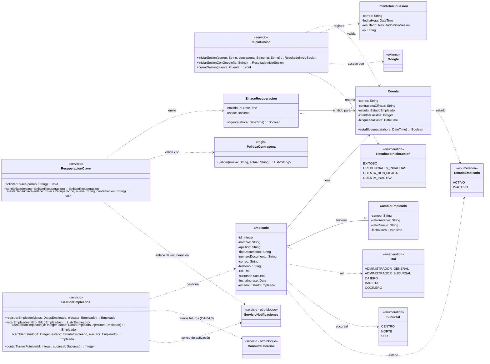

```mermaid
classDiagram
    direction LR

    class InicioSesion {
        <<servicio>>
        +iniciarSesion(correo: String, contrasena: String, ip: String): ResultadoInicioSesion
        +iniciarSesionConGoogle(ip: String): ResultadoInicioSesion
        +cerrarSesion(cuenta: Cuenta): void
    }
    class RecuperacionClave {
        <<servicio>>
        +solicitarEnlace(correo: String): void
        +abrirEnlace(enlace: EnlaceRecuperacion): EnlaceRecuperacion
        +restablecerClave(enlace: EnlaceRecuperacion, nueva: String, confirmacion: String): void
    }
    class Cuenta {
        -correo: String
        -contrasenaCifrada: String
        -estado: EstadoEmpleado
        -intentosFallidos: Integer
        -bloqueadaHasta: DateTime
        +estaBloqueada(ahora: DateTime): Boolean
    }
    class IntentoInicioSesion {
        -correo: String
        -fechaHora: DateTime
        -resultado: ResultadoInicioSesion
        -ip: String
    }
    class EnlaceRecuperacion {
        -emitidoEn: DateTime
        -usado: Boolean
        +vigente(ahora: DateTime): Boolean
    }
    class PoliticaContrasena {
        <<regla>>
        +validar(nueva: String, actual: String): List~String~
    }
    class ResultadoInicioSesion {
        <<enumeration>>
        EXITOSO
        CREDENCIALES_INVALIDAS
        CUENTA_BLOQUEADA
        CUENTA_INACTIVA
    }
    class Google {
        <<externo>>
    }
    class GestionEmpleados {
        <<servicio>>
        +registrarEmpleado(datos: DatosEmpleado, ejecutor: Empleado): Empleado
        +listarEmpleados(filtro: FiltroEmpleados): List~Empleado~
        +actualizarEmpleado(id: Integer, datos: DatosEmpleado, ejecutor: Empleado): Empleado
        +cambiarEstado(id: Integer, estado: EstadoEmpleado, ejecutor: Empleado): Empleado
        +contarTurnosFuturos(id: Integer, sucursal: Sucursal): Integer
    }
    class Empleado {
        -id: Integer
        -nombre: String
        -apellido: String
        -tipoDocumento: String
        -numeroDocumento: String
        -correo: String
        -telefono: String
        -rol: Rol
        -sucursal: Sucursal
        -fechaIngreso: Date
        -estado: EstadoEmpleado
    }
    class CambioEmpleado {
        -campo: String
        -valorAnterior: String
        -valorNuevo: String
        -fechaHora: DateTime
    }
    class Rol {
        <<enumeration>>
        ADMINISTRADOR_GENERAL
        ADMINISTRADOR_SUCURSAL
        CAJERO
        BARISTA
        COCINERO
    }
    class Sucursal {
        <<enumeration>>
        CENTRO
        NORTE
        SUR
    }
    class EstadoEmpleado {
        <<enumeration>>
        ACTIVO
        INACTIVO
    }
    class ServicioNotificaciones {
        <<servicio · otro bloque>>
    }
    class ConsultaHorarios {
        <<servicio · otro bloque>>
    }

    Empleado "1" --> "1" Cuenta : tiene
    EnlaceRecuperacion "0..*" --> "1" Cuenta : emitido para
    InicioSesion ..> Cuenta : valida
    InicioSesion ..> IntentoInicioSesion : registra
    InicioSesion ..> Google : acceso con
    InicioSesion ..> ResultadoInicioSesion : retorna
    RecuperacionClave ..> EnlaceRecuperacion : emite
    RecuperacionClave ..> PoliticaContrasena : valida con
    RecuperacionClave ..> ServicioNotificaciones : enlace de recuperación
    GestionEmpleados ..> Empleado : gestiona
    GestionEmpleados ..> ConsultaHorarios : turnos futuros (CA-04.3)
    GestionEmpleados ..> ServicioNotificaciones : correo de activación
    Empleado "1" o-- "0..*" CambioEmpleado : historial
    Empleado ..> Rol : rol
    Empleado ..> Sucursal : sucursal
    Empleado ..> EstadoEmpleado : estado
    Cuenta ..> EstadoEmpleado : estado

    classDef servicio fill:#eff6ff,stroke:#60a5fa,color:#1e3a8a
    classDef enumeration fill:#fdf2f8,stroke:#f472b6,color:#831843
    classDef externo fill:#f3f4f6,stroke:#9ca3af,color:#374151
    classDef otrobloque fill:#ffffff,stroke:#9ca3af,stroke-dasharray:4 3,color:#6b7280

    cssClass "GestionEmpleados,InicioSesion,RecuperacionClave" servicio
    cssClass "EstadoEmpleado,ResultadoInicioSesion,Rol,Sucursal" enumeration
    cssClass "Google" externo
    cssClass "ConsultaHorarios,ServicioNotificaciones" otrobloque
```
