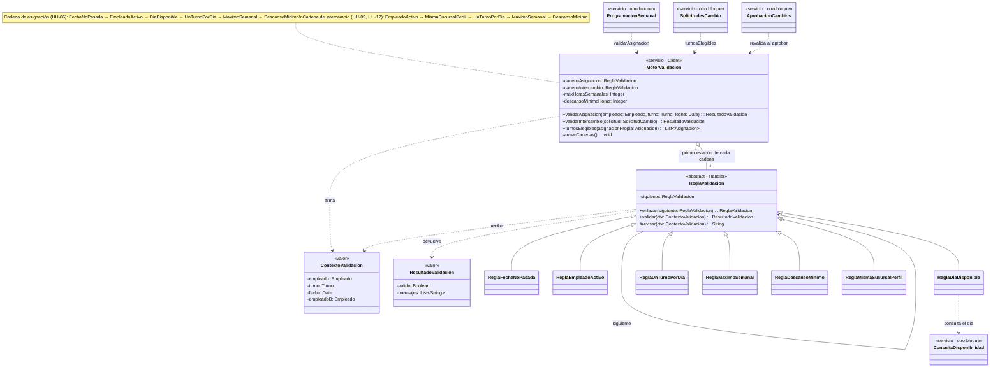

```mermaid
classDiagram
    direction TB

    class MotorValidacion {
        <<servicio · Client>>
        -cadenaAsignacion: ReglaValidacion
        -cadenaIntercambio: ReglaValidacion
        -maxHorasSemanales: Integer
        -descansoMinimoHoras: Integer
        +validarAsignacion(empleado: Empleado, turno: Turno, fecha: Date): ResultadoValidacion
        +validarIntercambio(solicitud: SolicitudCambio): ResultadoValidacion
        +turnosElegibles(asignacionPropia: Asignacion): List~Asignacion~
        -armarCadenas(): void
    }
    class ReglaValidacion {
        <<abstract · Handler>>
        -siguiente: ReglaValidacion
        +enlazar(siguiente: ReglaValidacion): ReglaValidacion
        +validar(ctx: ContextoValidacion): ResultadoValidacion
        #revisar(ctx: ContextoValidacion): String
    }
    class ContextoValidacion {
        <<valor>>
        -empleado: Empleado
        -turno: Turno
        -fecha: Date
        -empleadoB: Empleado
    }
    class ResultadoValidacion {
        <<valor>>
        -valido: Boolean
        -mensajes: List~String~
    }
    class ReglaFechaNoPasada
    class ReglaEmpleadoActivo
    class ReglaDiaDisponible
    class ReglaUnTurnoPorDia
    class ReglaMaximoSemanal
    class ReglaDescansoMinimo
    class ReglaMismaSucursalPerfil
    class ProgramacionSemanal {
        <<servicio · otro bloque>>
    }
    class SolicitudesCambio {
        <<servicio · otro bloque>>
    }
    class AprobacionCambios {
        <<servicio · otro bloque>>
    }
    class ConsultaDisponibilidad {
        <<servicio · otro bloque>>
    }

    MotorValidacion "1" o-- "2" ReglaValidacion : primer eslabón de cada cadena
    ReglaValidacion "1" --> "0..1" ReglaValidacion : siguiente
    ReglaValidacion <|-- ReglaFechaNoPasada
    ReglaValidacion <|-- ReglaEmpleadoActivo
    ReglaValidacion <|-- ReglaDiaDisponible
    ReglaValidacion <|-- ReglaUnTurnoPorDia
    ReglaValidacion <|-- ReglaMaximoSemanal
    ReglaValidacion <|-- ReglaDescansoMinimo
    ReglaValidacion <|-- ReglaMismaSucursalPerfil
    MotorValidacion ..> ContextoValidacion : arma
    ReglaValidacion ..> ContextoValidacion : recibe
    ReglaValidacion ..> ResultadoValidacion : devuelve
    ReglaDiaDisponible ..> ConsultaDisponibilidad : consulta el día
    ProgramacionSemanal ..> MotorValidacion : validarAsignacion
    SolicitudesCambio ..> MotorValidacion : turnosElegibles
    AprobacionCambios ..> MotorValidacion : revalida al aprobar

    note for MotorValidacion "Cadena de asignación (HU-06): FechaNoPasada → EmpleadoActivo → DiaDisponible → UnTurnoPorDia → MaximoSemanal → DescansoMinimo\nCadena de intercambio (HU-09, HU-12): EmpleadoActivo → MismaSucursalPerfil → UnTurnoPorDia → MaximoSemanal → DescansoMinimo"

    classDef otrobloque fill:#ffffff,stroke:#9ca3af,stroke-dasharray:4 3,color:#6b7280
    cssClass "AprobacionCambios,ConsultaDisponibilidad,ProgramacionSemanal,SolicitudesCambio" otrobloque
```
