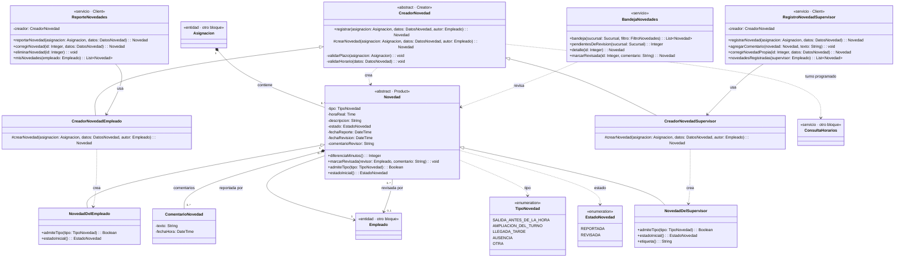

```mermaid
classDiagram
    direction TB

    class ReporteNovedades {
        <<servicio · Client>>
        -creador: CreadorNovedad
        +reportarNovedad(asignacion: Asignacion, datos: DatosNovedad): Novedad
        +corregirNovedad(id: Integer, datos: DatosNovedad): Novedad
        +eliminarNovedad(id: Integer): void
        +misNovedades(empleado: Empleado): List~Novedad~
    }
    class BandejaNovedades {
        <<servicio>>
        +bandeja(sucursal: Sucursal, filtro: FiltroNovedades): List~Novedad~
        +pendientesDeRevision(sucursal: Sucursal): Integer
        +detalle(id: Integer): Novedad
        +marcarRevisada(id: Integer, comentario: String): Novedad
    }
    class RegistroNovedadSupervisor {
        <<servicio · Client>>
        -creador: CreadorNovedad
        +registrarNovedad(asignacion: Asignacion, datos: DatosNovedad): Novedad
        +agregarComentario(novedad: Novedad, texto: String): void
        +corregirNovedadPropia(id: Integer, datos: DatosNovedad): Novedad
        +novedadesRegistradas(supervisor: Empleado): List~Novedad~
    }
    class CreadorNovedad {
        <<abstract · Creator>>
        +registrar(asignacion: Asignacion, datos: DatosNovedad, autor: Empleado): Novedad
        #crearNovedad(asignacion: Asignacion, datos: DatosNovedad, autor: Empleado): Novedad
        -validarPlazo(asignacion: Asignacion): void
        -validarHorario(datos: DatosNovedad): void
    }
    class CreadorNovedadEmpleado {
        #crearNovedad(asignacion: Asignacion, datos: DatosNovedad, autor: Empleado): Novedad
    }
    class CreadorNovedadSupervisor {
        #crearNovedad(asignacion: Asignacion, datos: DatosNovedad, autor: Empleado): Novedad
    }
    class Novedad {
        <<abstract · Product>>
        -tipo: TipoNovedad
        -horaReal: Time
        -descripcion: String
        -estado: EstadoNovedad
        -fechaReporte: DateTime
        -fechaRevision: DateTime
        -comentarioRevisor: String
        +diferenciaMinutos(): Integer
        +marcarRevisada(revisor: Empleado, comentario: String): void
        +admiteTipo(tipo: TipoNovedad): Boolean
        +estadoInicial(): EstadoNovedad
    }
    class NovedadDelEmpleado {
        +admiteTipo(tipo: TipoNovedad): Boolean
        +estadoInicial(): EstadoNovedad
    }
    class NovedadDelSupervisor {
        +admiteTipo(tipo: TipoNovedad): Boolean
        +estadoInicial(): EstadoNovedad
        +etiqueta(): String
    }
    class ComentarioNovedad {
        -texto: String
        -fechaHora: DateTime
    }
    class TipoNovedad {
        <<enumeration>>
        SALIDA_ANTES_DE_LA_HORA
        AMPLIACION_DEL_TURNO
        LLEGADA_TARDE
        AUSENCIA
        OTRA
    }
    class EstadoNovedad {
        <<enumeration>>
        REPORTADA
        REVISADA
    }
    class Asignacion {
        <<entidad · otro bloque>>
    }
    class Empleado {
        <<entidad · otro bloque>>
    }
    class ConsultaHorarios {
        <<servicio · otro bloque>>
    }

    Asignacion "1" *-- "0..*" Novedad : contiene
    Novedad "1" *-- "0..*" ComentarioNovedad : comentarios
    Novedad "0..*" --> "1" Empleado : reportada por
    Novedad "0..*" --> "0..1" Empleado : revisada por
    Novedad ..> TipoNovedad : tipo
    Novedad ..> EstadoNovedad : estado
    Novedad <|-- NovedadDelEmpleado
    Novedad <|-- NovedadDelSupervisor
    CreadorNovedad <|-- CreadorNovedadEmpleado
    CreadorNovedad <|-- CreadorNovedadSupervisor
    CreadorNovedad ..> Novedad : crea
    CreadorNovedadEmpleado ..> NovedadDelEmpleado : crea
    CreadorNovedadSupervisor ..> NovedadDelSupervisor : crea
    ReporteNovedades --> CreadorNovedadEmpleado : usa
    RegistroNovedadSupervisor --> CreadorNovedadSupervisor : usa
    BandejaNovedades ..> Novedad : revisa
    CreadorNovedad ..> ConsultaHorarios : turno programado

    classDef servicio fill:#eff6ff,stroke:#60a5fa,color:#1e3a8a
    classDef enumeration fill:#fdf2f8,stroke:#f472b6,color:#831843
    classDef otrobloque fill:#ffffff,stroke:#9ca3af,stroke-dasharray:4 3,color:#6b7280

    cssClass "BandejaNovedades,RegistroNovedadSupervisor,ReporteNovedades" servicio
    cssClass "EstadoNovedad,TipoNovedad" enumeration
    cssClass "Asignacion,ConsultaHorarios,Empleado" otrobloque
```
