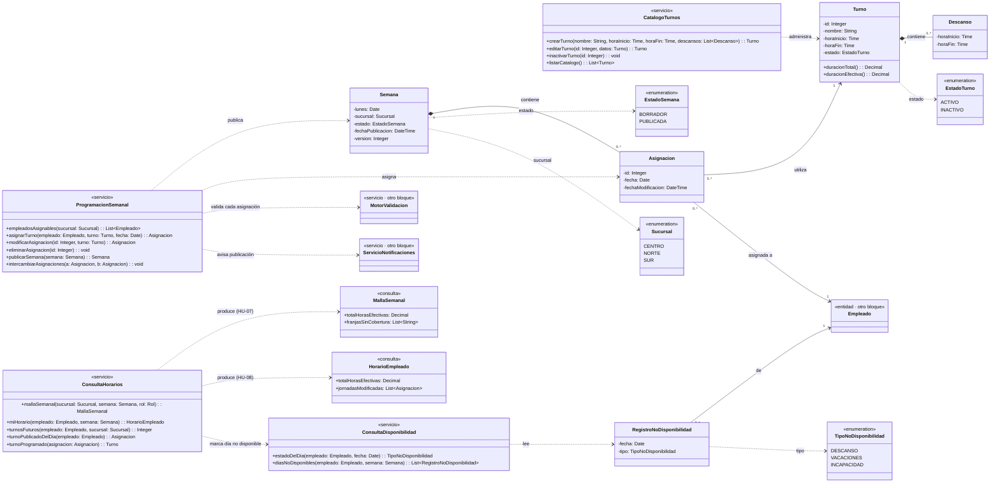

```mermaid
classDiagram
    direction LR

    class CatalogoTurnos {
        <<servicio>>
        +crearTurno(nombre: String, horaInicio: Time, horaFin: Time, descansos: List~Descanso~): Turno
        +editarTurno(id: Integer, datos: Turno): Turno
        +inactivarTurno(id: Integer): void
        +listarCatalogo(): List~Turno~
    }
    class ProgramacionSemanal {
        <<servicio>>
        +empleadosAsignables(sucursal: Sucursal): List~Empleado~
        +asignarTurno(empleado: Empleado, turno: Turno, fecha: Date): Asignacion
        +modificarAsignacion(id: Integer, turno: Turno): Asignacion
        +eliminarAsignacion(id: Integer): void
        +publicarSemana(semana: Semana): Semana
        +intercambiarAsignaciones(a: Asignacion, b: Asignacion): void
    }
    class ConsultaHorarios {
        <<servicio>>
        +mallaSemanal(sucursal: Sucursal, semana: Semana, rol: Rol): MallaSemanal
        +miHorario(empleado: Empleado, semana: Semana): HorarioEmpleado
        +turnosFuturos(empleado: Empleado, sucursal: Sucursal): Integer
        +turnoPublicadoDelDia(empleado: Empleado): Asignacion
        +turnoProgramado(asignacion: Asignacion): Turno
    }
    class Turno {
        -id: Integer
        -nombre: String
        -horaInicio: Time
        -horaFin: Time
        -estado: EstadoTurno
        +duracionTotal(): Decimal
        +duracionEfectiva(): Decimal
    }
    class Descanso {
        -horaInicio: Time
        -horaFin: Time
    }
    class Semana {
        -lunes: Date
        -sucursal: Sucursal
        -estado: EstadoSemana
        -fechaPublicacion: DateTime
        -version: Integer
    }
    class Asignacion {
        -id: Integer
        -fecha: Date
        -fechaModificacion: DateTime
    }
    class MallaSemanal {
        <<consulta>>
        +totalHorasEfectivas: Decimal
        +franjasSinCobertura: List~String~
    }
    class HorarioEmpleado {
        <<consulta>>
        +totalHorasEfectivas: Decimal
        +jornadasModificadas: List~Asignacion~
    }
    class EstadoTurno {
        <<enumeration>>
        ACTIVO
        INACTIVO
    }
    class EstadoSemana {
        <<enumeration>>
        BORRADOR
        PUBLICADA
    }
    class ConsultaDisponibilidad {
        <<servicio>>
        +estadoDelDia(empleado: Empleado, fecha: Date): TipoNoDisponibilidad
        +diasNoDisponibles(empleado: Empleado, semana: Semana): List~RegistroNoDisponibilidad~
    }
    class RegistroNoDisponibilidad {
        -fecha: Date
        -tipo: TipoNoDisponibilidad
    }
    class TipoNoDisponibilidad {
        <<enumeration>>
        DESCANSO
        VACACIONES
        INCAPACIDAD
    }
    class Empleado {
        <<entidad · otro bloque>>
    }
    class Sucursal {
        <<enumeration>>
        CENTRO
        NORTE
        SUR
    }
    class MotorValidacion {
        <<servicio · otro bloque>>
    }
    class ServicioNotificaciones {
        <<servicio · otro bloque>>
    }

    CatalogoTurnos ..> Turno : administra
    Turno "1" *-- "0..*" Descanso : contiene
    Turno ..> EstadoTurno : estado
    Semana "1" *-- "0..*" Asignacion : contiene
    Semana ..> EstadoSemana : estado
    Semana ..> Sucursal : sucursal
    Asignacion "0..*" --> "1" Turno : utiliza
    Asignacion "0..*" --> "1" Empleado : asignada a
    ProgramacionSemanal ..> Semana : publica
    ProgramacionSemanal ..> Asignacion : asigna
    ProgramacionSemanal ..> MotorValidacion : valida cada asignación
    ProgramacionSemanal ..> ServicioNotificaciones : avisa publicación
    ConsultaHorarios ..> MallaSemanal : produce (HU-07)
    ConsultaHorarios ..> HorarioEmpleado : produce (HU-08)
    ConsultaHorarios ..> ConsultaDisponibilidad : marca día no disponible
    RegistroNoDisponibilidad "0..*" --> "1" Empleado : de
    RegistroNoDisponibilidad ..> TipoNoDisponibilidad : tipo
    ConsultaDisponibilidad ..> RegistroNoDisponibilidad : lee

    classDef servicio fill:#eff6ff,stroke:#60a5fa,color:#1e3a8a
    classDef enumeration fill:#fdf2f8,stroke:#f472b6,color:#831843
    classDef otrobloque fill:#ffffff,stroke:#9ca3af,stroke-dasharray:4 3,color:#6b7280

    cssClass "CatalogoTurnos,ConsultaDisponibilidad,ConsultaHorarios,ProgramacionSemanal" servicio
    cssClass "EstadoSemana,EstadoTurno,Sucursal,TipoNoDisponibilidad" enumeration
    cssClass "Empleado,MotorValidacion,ServicioNotificaciones" otrobloque
```
