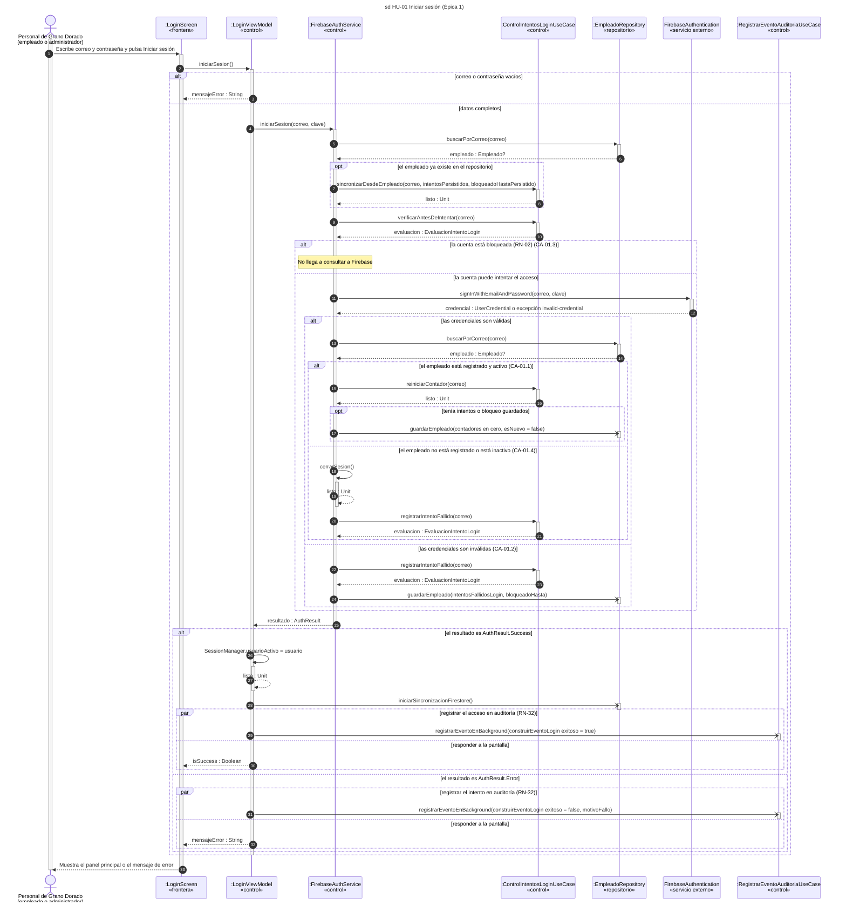

```mermaid
---
title: "sd HU-01 Iniciar sesión (Épica 1)"
---
sequenceDiagram
    autonumber
    actor U as Personal de Grano Dorado<br/>(empleado o administrador)
    participant LS as :LoginScreen<br/>«frontera»
    participant LVM as :LoginViewModel<br/>«control»
    participant AS as :FirebaseAuthService<br/>«control»
    participant CI as :ControlIntentosLoginUseCase<br/>«control»
    participant ER as :EmpleadoRepository<br/>«repositorio»
    participant FA as FirebaseAuthentication<br/>«servicio externo»
    participant AU as :RegistrarEventoAuditoriaUseCase<br/>«control»

    activate U
    U->>+LS: Escribe correo y contraseña y pulsa Iniciar sesión
    LS->>+LVM: iniciarSesion()
    alt correo o contraseña vacíos
        LVM-->>LS: mensajeError : String
    else datos completos
        LVM->>+AS: iniciarSesion(correo, clave)
        AS->>+ER: buscarPorCorreo(correo)
        ER-->>-AS: empleado : Empleado?
        opt el empleado ya existe en el repositorio
            AS->>+CI: sincronizarDesdeEmpleado(correo, intentosPersistidos, bloqueadoHastaPersistido)
            CI-->>-AS: listo : Unit
        end
        AS->>+CI: verificarAntesDeIntentar(correo)
        CI-->>-AS: evaluacion : EvaluacionIntentoLogin
        alt la cuenta está bloqueada (RN-02) (CA-01.3)
            Note over AS: No llega a consultar a Firebase
        else la cuenta puede intentar el acceso
            AS->>+FA: signInWithEmailAndPassword(correo, clave)
            FA-->>-AS: credencial : UserCredential o excepción invalid-credential
            alt las credenciales son válidas
                AS->>+ER: buscarPorCorreo(correo)
                ER-->>-AS: empleado : Empleado?
                alt el empleado está registrado y activo (CA-01.1)
                    AS->>+CI: reiniciarContador(correo)
                    CI-->>-AS: listo : Unit
                    opt tenía intentos o bloqueo guardados
                        AS-)ER: guardarEmpleado(contadores en cero, esNuevo = false)
                        activate ER
                        deactivate ER
                    end
                else el empleado no está registrado o está inactivo (CA-01.4)
                    AS->>+AS: cerrarSesion()
                    AS-->>-AS: listo : Unit
                    AS->>+CI: registrarIntentoFallido(correo)
                    CI-->>-AS: evaluacion : EvaluacionIntentoLogin
                end
            else las credenciales son inválidas (CA-01.2)
                AS->>+CI: registrarIntentoFallido(correo)
                CI-->>-AS: evaluacion : EvaluacionIntentoLogin
                AS-)ER: guardarEmpleado(intentosFallidosLogin, bloqueadoHasta)
                activate ER
                deactivate ER
            end
        end
        AS-->>-LVM: resultado : AuthResult
        alt el resultado es AuthResult.Success
            LVM->>+LVM: SessionManager.usuarioActivo = usuario
            LVM-->>-LVM: listo : Unit
            LVM-)ER: iniciarSincronizacionFirestore()
            activate ER
            deactivate ER
            par registrar el acceso en auditoría (RN-32)
                LVM-)AU: registrarEventoEnBackground(construirEventoLogin exitoso = true)
                activate AU
                deactivate AU
            and responder a la pantalla
                LVM-->>LS: isSuccess : Boolean
            end
        else el resultado es AuthResult.Error
            par registrar el intento en auditoría (RN-32)
                LVM-)AU: registrarEventoEnBackground(construirEventoLogin exitoso = false, motivoFallo)
                activate AU
                deactivate AU
            and responder a la pantalla
                LVM-->>LS: mensajeError : String
            end
        end
    end
    deactivate LVM
    LS-->>-U: Muestra el panel principal o el mensaje de error
    deactivate U
```
