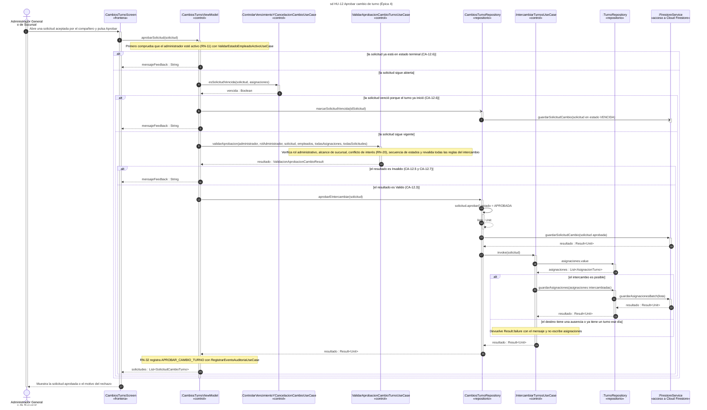

```mermaid
---
title: "sd HU-12 Aprobar cambio de turno (Épica 4)"
---
sequenceDiagram
    autonumber
    actor AD as Administrador General<br/>o de Sucursal
    participant CS as :CambiosTurnoScreen<br/>«frontera»
    participant CVM as :CambiosTurnoViewModel<br/>«control»
    participant CV as :ControlarVencimientoYCancelacionCambioUseCase<br/>«control»
    participant VA as :ValidarAprobacionCambioTurnoUseCase<br/>«control»
    participant CR as :CambiosTurnoRepository<br/>«repositorio»
    participant IT as :IntercambiarTurnosUseCase<br/>«control»
    participant TR as :TurnoRepository<br/>«repositorio»
    participant FS as :FirestoreService<br/>«acceso a Cloud Firestore»

    activate AD
    AD->>+CS: Abre una solicitud aceptada por el compañero y pulsa Aprobar
    CS->>+CVM: aprobarSolicitud(solicitud)
    Note over CVM: Primero comprueba que el administrador esté activo (RN-11) con ValidarEstadoEmpleadoActivoUseCase
    alt la solicitud ya está en estado terminal (CA-12.6)
        CVM-->>CS: mensajeFeedback : String
    else la solicitud sigue abierta
        CVM->>+CV: esSolicitudVencida(solicitud, asignaciones)
        CV-->>-CVM: vencida : Boolean
        alt la solicitud venció porque el turno ya inició (CA-12.6)
            CVM-)CR: marcarSolicitudVencida(idSolicitud)
            activate CR
            CR-)FS: guardarSolicitudCambio(solicitud en estado VENCIDA)
            activate FS
            deactivate FS
            deactivate CR
            CVM-->>CS: mensajeFeedback : String
        else la solicitud sigue vigente
            CVM->>+VA: validarAprobacion(administrador, rolAdministrador, solicitud, empleados, todasAsignaciones, todasSolicitudes)
            Note over VA: Verifica rol administrativo, alcance de sucursal, conflicto de interés (RN-20), secuencia de estados y revalida todas las reglas del intercambio
            VA-->>-CVM: resultado : ValidacionAprobacionCambioResult
            alt el resultado es Invalido (CA-12.5 y CA-12.7)
                CVM-->>CS: mensajeFeedback : String
            else el resultado es Valido (CA-12.3)
                CVM->>+CR: aprobarEIntercambiar(solicitud)
                CR->>+CR: solicitud.aprobar() estado = APROBADA
                CR-->>-CR: listo : Unit
                CR->>+FS: guardarSolicitudCambio(solicitud aprobada)
                FS-->>-CR: resultado : Result<Unit>
                CR->>+IT: invoke(solicitud)
                IT->>+TR: asignaciones.value
                TR-->>-IT: asignaciones : List<AsignacionTurno>
                alt el intercambio es posible
                    IT->>+TR: guardarAsignaciones(asignaciones intercambiadas)
                    TR->>+FS: guardarAsignacionesBatch(lista)
                    FS-->>-TR: resultado : Result<Unit>
                    TR-->>-IT: resultado : Result<Unit>
                else el destino tiene una ausencia o ya tiene un turno ese día
                    Note over IT: Devuelve Result.failure con el mensaje y no escribe asignaciones
                end
                IT-->>-CR: resultado : Result<Unit>
                CR-->>-CVM: resultado : Result<Unit>
                Note over CVM: RN-32 registra APROBAR_CAMBIO_TURNO con RegistrarEventoAuditoriaUseCase
                CVM-->>CS: solicitudes : List<SolicitudCambioTurno>
            end
        end
    end
    deactivate CVM
    CS-->>-AD: Muestra la solicitud aprobada o el motivo del rechazo
    deactivate AD
```
